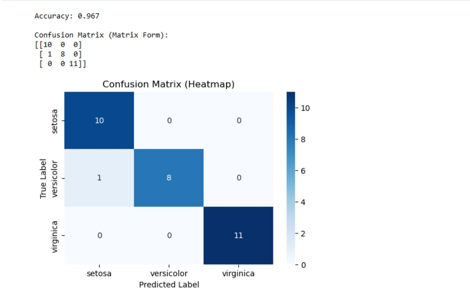

# SGD-Classifier
## AIM:
To write a program to predict the type of species of the Iris flower using the SGD Classifier.

## Equipments Required:
1. Hardware – PCs
2. Anaconda – Python 3.7 Installation / Jupyter notebook

## Algorithm
1. 
2. 
3. 
4. 

## Program:
```
/*
Program to implement the prediction of iris species using SGD Classifier.
Developed by: Tamil Selvan S
RegisterNumber:  212225230282

import pandas as pd
from sklearn.datasets import load_iris
from sklearn.linear_model import SGDClassifier
from sklearn.model_selection import train_test_split
from sklearn.preprocessing import StandardScaler
from sklearn.metrics import accuracy_score, confusion_matrix
import seaborn as sns
import matplotlib.pyplot as plt
iris = load_iris()
df = pd.DataFrame(iris.data, columns=iris.feature_names)
df['target'] = iris.target

X = df.drop('target', axis=1)
y = df['target']

X_train, X_test, y_train, y_test = train_test_split(
    X, y, test_size=0.2, random_state=42
)
scaler = StandardScaler()
X_train = scaler.fit_transform(X_train)
X_test = scaler.transform(X_test)

sgd_clf = SGDClassifier(
    loss="log_loss",
    max_iter=1000,
    tol=1e-3,
    random_state=42
)
sgd_clf.fit(X_train, y_train)

y_pred = sgd_clf.predict(X_test)

accuracy = accuracy_score(y_test, y_pred)
print(f"Accuracy: {accuracy:.3f}")
cm = confusion_matrix(y_test, y_pred)
print("\nConfusion Matrix (Matrix Form):")
print(cm)
plt.figure(figsize=(6,4))
sns.heatmap(
    cm,
    annot=True,
    fmt='d',
    cmap="Blues",
    xticklabels=iris.target_names,
    yticklabels=iris.target_names
)
plt.xlabel("Predicted Label")
plt.ylabel("True Label")
plt.title("Confusion Matrix (Heatmap)")
plt.show()


*/
```

## Output:



## Result:
Thus, the program to implement the prediction of the Iris species using SGD Classifier is written and verified using Python programming.
